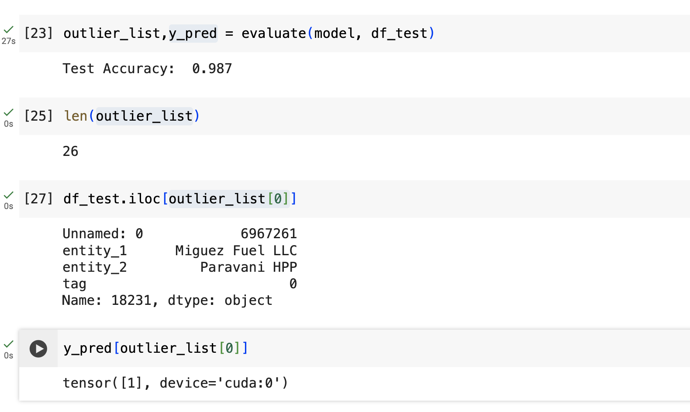
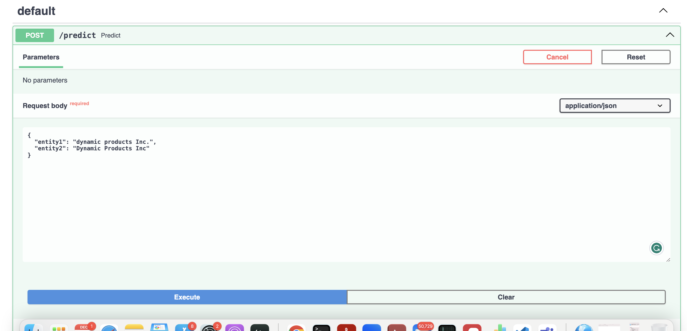
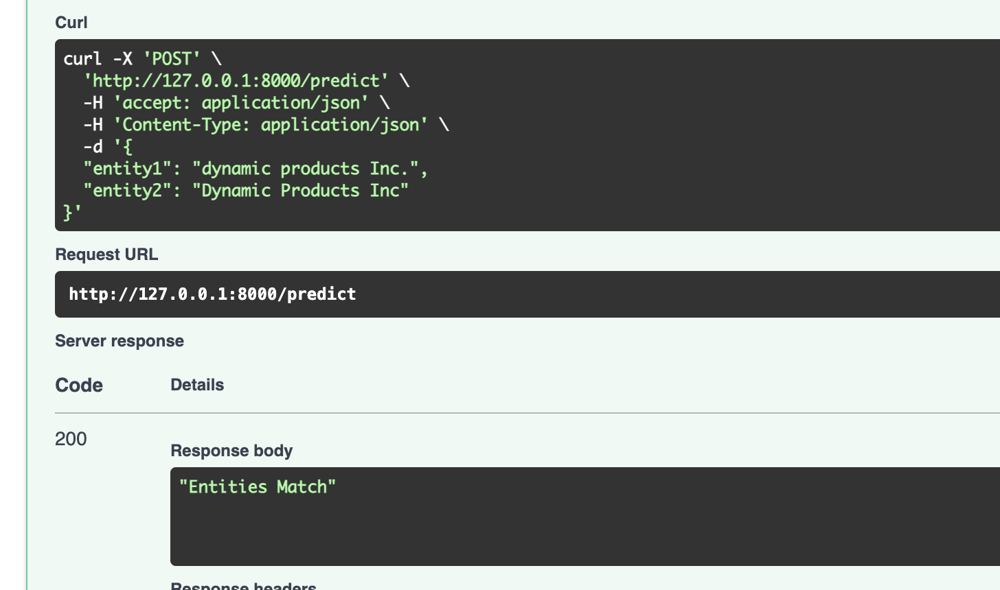
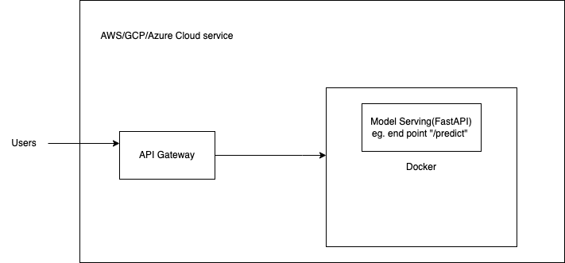

Task 1:

We would be using a pre-trained transformer Language Model like BERT, and fine-tuning with the Entity Matching data provided to us. We treat this problem as a sequence pair classification task. We use pre-trained LMs, which have been shown to generate highly contextualized embeddings that capture better language understanding compared to traditional word embeddings.
The input would be encoded as [CLS]entity1[SEP]entity2[SEP].

Trained it over a subset of the data(16000 samples) and got a test accuracy of 98.7%

Please refer to the code task_part1.ipynb.  \
I used a colab notebook, A100 GPU to train the model.



Task 2.1:

Have created a fastAPI that loads the model on startup.
Created an endpoint that accepts 2 entities and predicts if they are the same or not.
Please refer to main.py that has the code for the same.




How to run? \
Step 1: ```pip install -r requirements.txt``` \
Step 2: Please download fine-tuned [model](https://drive.google.com/file/d/1FcSCDf09EtSqxzXDxjPVcNsr8QX7SwTS/view?usp=sharing) and place is into the model directory. \
Step 3: ```uvicorn main:app```



Briefly attempting 2.2
As the training data keeps increasing, it is essential to monitor data drift and re-train and re-deploy the model periodically.
- Monitoring (includes Data Drift Detection,Set up alerts for significant deviations from expected performance,Gather feedback from users or domain experts to identify issues or inaccuracies that the model might be producing in real-world scenarios)\
Tools: Weights and Biases, MLflow\
-Retraining:(Create automated pipelines that trigger retraining based on predefined conditions, such as reaching a certain level of data drift or model degradation.)\
Tools: Apache Airflow
 


